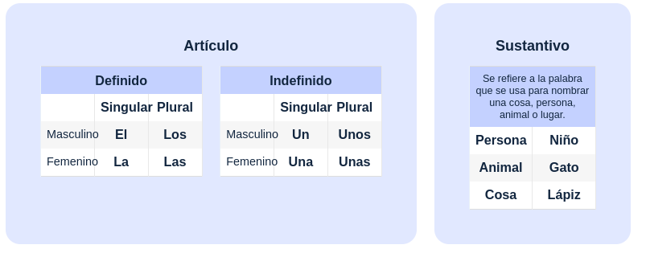
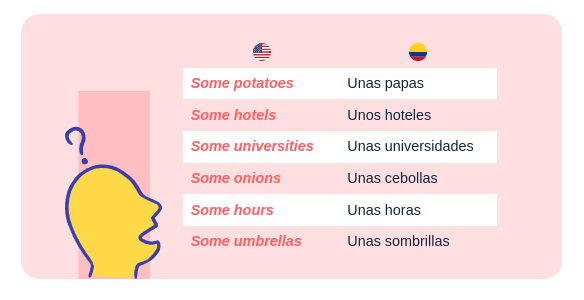
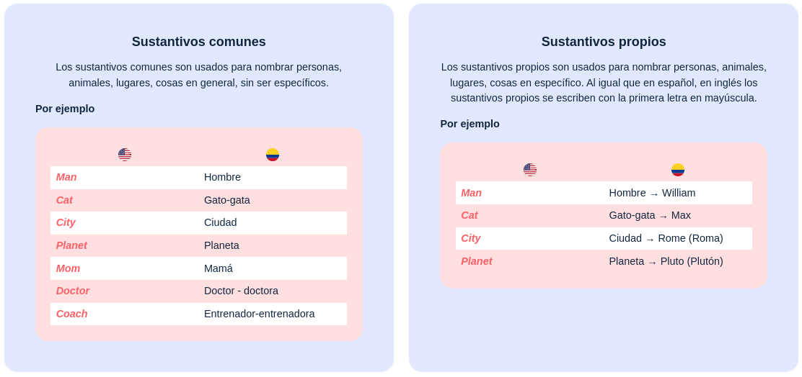

# 1. Categorias gramaticales basicas

Los articulos y los sustantivos son las palabras gramticales basicas, que no solamente dan un punto de aprtida para aprender a formular oraciones y estructuras mas complejas en este nuevo idioma, sino que, a su vez, ayudan a entender conceptos en ingles, como que las cosas (Sustantivos) no varian en genero (Masculino o Femenino) como en español, sino solo en numero (Singular y prural).

1. **Tabla:  Articulos y Sustantivos**

## 1.1 Articulos definidos e indefinidos

* Los articulos son palabras que definen los sustantivos como algo especifico o inespecifico. Es decir, informan si eso de lo que se habla (el sustantivo) es algo conocido y definido, o algo desconocido e indefinido:

    1. **Articulo definido (Determinado)**
        * En español, los articulos definidos son **el/la/los/las** y varian en numero (singular, prural) y en genero (masculino y femenino), al igual que lo hacen los sustantivos; pero en el caso del idioma ingles, se cuenta exclusivamente con el articulo definido **the** para preceder el sustantivo especifico al que nos referimos.
            * **THE** no varia en numero (singular o prural): *The lemon - the lemons*.
            * **THE** no varia en genero (femenino o masculino) *The cat  - the cats*.
            
    2. **Articulos indefinidos (Indeterminados)**
        * En español, los  articulos indefinidos son **un/una/unos/unas** y varia en numero (prural o singular) y en genero (femenino o masculino), al igual que lo hacen los sustantivos, pero en ele caso del idioma ingles, se cuenta con los articulos indefinidos  **a/an** para preceder el sustantivo (en singular) incespecifico al que se hace referencia.
        * Los articulos indefinidos **a/an** son singulares y equivalen en español a los articulos **un/una**, pero no varian en genero. El factor clave para discernir cual de los dos usar depende del sustantivo que va despues.
            * Usamos **a** si el sustantivo que va despues comienza con un sonido consonante:
                * **A potato** una patata
                * **A hotel** un hotel
                * **A university**   una universidad
            * Usamos **an** si el sustantivo que va despues comienza con un sonido vocalico
                * **An onion** una cebolla
                * **An hour** una hora
                * **An umbrella** una sombrilla
                
* Cuando se va a hacer referencia de forma no especifica a mas de un sustantivo se puede usar **some** para hacer las veces de **unos/unas**, teniendo en cuenta que **some** no es un articulo indefinido y puede interpretarse tambien como algunos / algunas.

2. **Tabla Some unos /unas**
            

## 1.2 Sustantivos comunes y propios relacionados

* Los sustantivos son  palabras que funcionan para nombrar algo y pueden hacer referencia a una persona (Willian Smith), una cosa (computer/computador), un animal (cat/gato-gata), un lugar (Rome/roma), una cualidad (opacity/opacidad), una idea (love/amor), una actividad (natacion/swimming).

 * **Nota:** A diferencia del español, en el idioma ingles los sustantivos no tienen genero.
 
* Existen varias categorias de sustantivos, como propios, comunes, contables, no contables, concretos, abstractos, compuestos, colectivos, entre otros.

* A veces, se puede hacer referencia a una persona no por su nombre, sino por su ocupacion, su profesion, su titulo laboral, o algun rol especifico que desempeña. En esta situacion, ese titulo se estaria usando como un caso vocativo (en ingles, llamado nous of address o vactives) y ese sustantivo seria considerado un sustantivo propio, sin importar que bajo cualquier otra circustancia sea considerado un sustantivo comun.
    * **Mom** mama.
    * **Doctor** doctor - doctora.
    * **Coach** entrenador - entrenadora.
    
