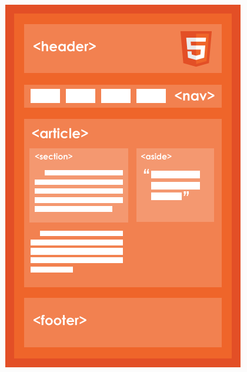
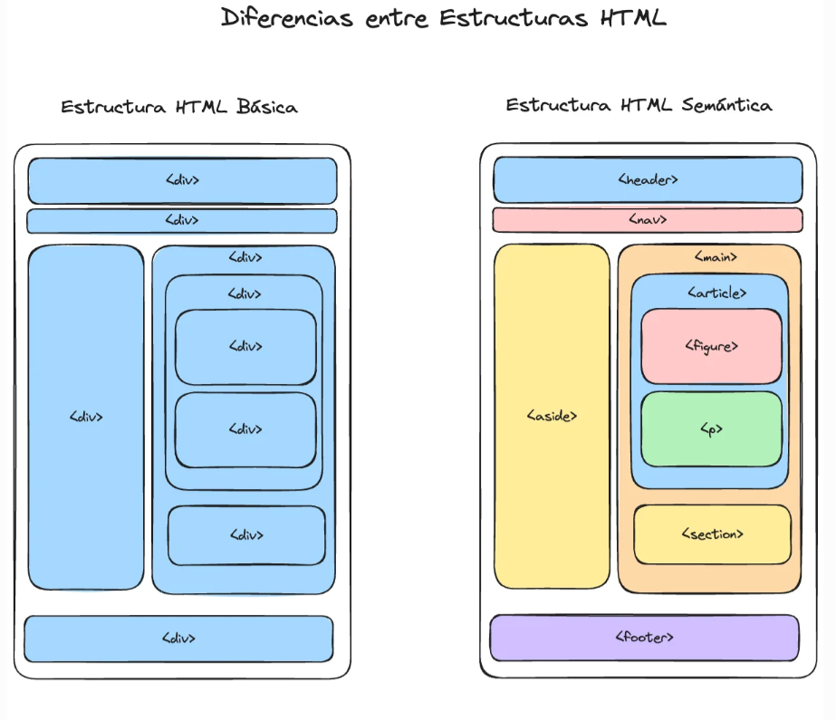

# Etiquetas Estructurales

* Define la Estructura y semantica de las partes que conforman la interfaz del documento **HTML**, es decir, proporcionan orden, sentido y signficado a cada una de las areas de contenido.

* Algunas de esta etiquetas son:
    
    * **div** Es una etiqueta contenedora de bloque que no tiene semantica.
    * **header** Representa la cabecera del sitio o de una seccion.
    * **nav** Represeta una navegacion.
    * **main** Define la seccion de contenido Principal, se recomiendo que solo exista un por documento.
    * **aside** Represeta una seccion de contenido complementario o secundario.
    * **article** Repesenta una seccion autocontenida (que por si sola se explica o se entiende)
    * **section** Representa una seccion de contenido generico.
    * **footer** Pie de pagina del estilo o de una seccion.
   

    